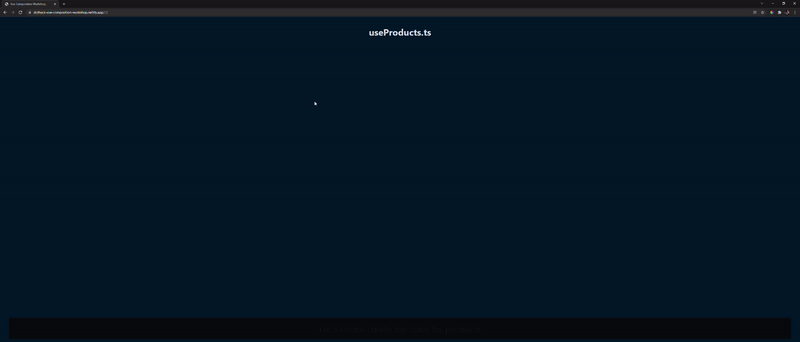
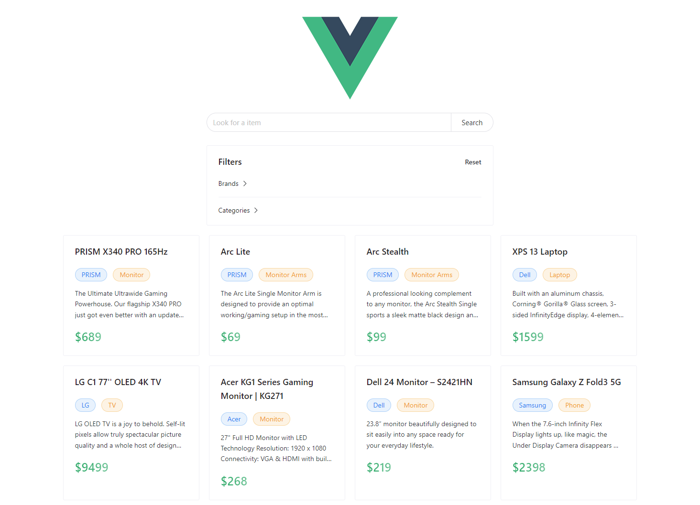

# .Hack Vue Composition workshop



[Link to Code Surfer](https://dothack-vue-composition-workshop.netlify.app/)

# Example Application


# Running Code Surfer

```bash
#install dependencies
yarn

# run code surfer on  http://localhost:8000/
yarn start

# build
yarn build
```

# Running Example Projects
## Composition API Project
```bash
# navigate to folder
cd project/composition

#install dependencies
yarn

# run project on  http://localhost:8080/
yarn serve
```

## Options API Project
```bash
# navigate to folder
cd project/options

#install dependencies
yarn

# run project on  http://localhost:8080/
yarn serve
```

# Libraries Used:
- [Vue 3](https://v3.vuejs.org/)
- [Lodash](https://lodash.com/)
- [Naive UI](https://www.naiveui.com/en-US/light)
- [Mirage JS](https://miragejs.com/)
